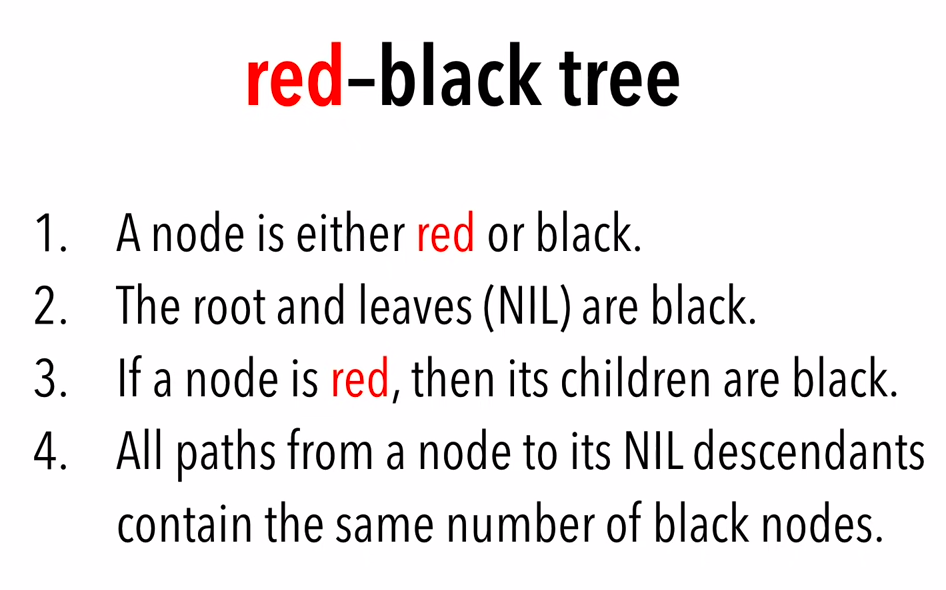

# 3_semester_ALG_coursework
Comparison RB Tree and Hash Table(separate chaining)

## Task:
Вариант 9
RB-дерево vs Хеш-таблица (метод цепочек).

"Исследование" - реализация требуемых структур данных/алгоритмов; генерация входных данных (вид входных данных определяется студентом); использование входных данных для измерения количественных характеристик структур данных, алгоритмов, действий; сравнение экспериментальных результатов с теоретическими. Вывод промежуточных данных не является строго обязательным, но должна быть возможность убедиться в корректности алгоритмов. 

##Notes

### Red-black Tree

### Generating tests

- Create random array name it d, insert it in data structures. Shuffle d, extract elements from data structures according to d.